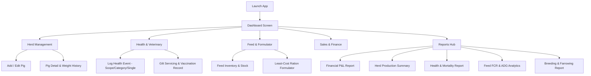
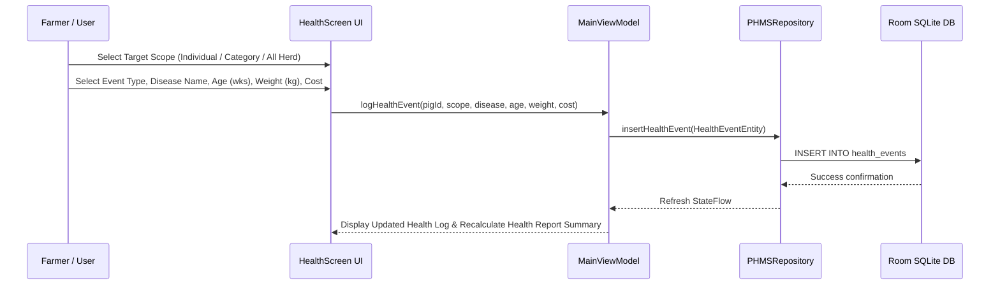

# KITALE NATIONAL POLYTECHNIC
## DEPARTMENT OF COMPUTER SCIENCE & INFORMATION TECHNOLOGY

---

# PROJECT REPORT & INNOVATION PROPOSAL

### **PROJECT TITLE:**
## **DIGITAL PIG FARM MANAGER (PHMS)**
*An Intelligent, Offline-First Mobile Application for Precision Swine Husbandry, Health Tracking, Least-Cost Feed Formulation, and Financial Analytics in Kenya*

---

### **EVENT:**
**KITALE AGRICULTURAL SOCIETY OF KENYA (ASK) SHOW 2026**

### **THEME OF THE SHOW:**
> *"Promoting Climate-Smart Agriculture, Technological Innovation, and Trade Initiatives for Sustainable Economic Growth"*

---

### **INNOVATOR DETAILS:**
* **Innovator Name:** Anditi Andrew Awala  
* **Admission / Registration No:** IT-DCSL/4451889/24  
* **Course:** Diploma in Computer Science & Information Technology  
* **Institution:** Kitale National Polytechnic  

### **PROJECT SUPERVISOR:**
* **Supervisor Name:** Mr. Harrison Wekesa  
* **Department:** Computer Science & IT, Kitale National Polytechnic  

### **DATE OF SUBMISSION:**
* September 2026  

---

\newpage

# EXECUTIVE SUMMARY

The smallholder pig farming sector in Kenya, particularly in Trans-Nzoia County and the wider Western/Rift Valley regions, plays a vital role in food security, employment generation, and economic empowerment. However, pig farmers face severe operational bottlenecks, including unorganized paper-based record-keeping, high feed prices (accounting for 70–80% of total production costs), untracked disease outbreaks, poor breeding management, and lack of real-time financial transparency.

The **Digital Pig Farm Manager** is a cutting-edge, offline-first mobile Android application designed specifically to address these challenges. Developed natively in Kotlin using modern Jetpack Compose UI, Room SQLite database, and automated analytics engine, the system empowers farmers to manage individual pig lifecycles, log health and vaccination events for single pigs or entire categories (weaners, growers, finishers, boars, sows), formulate least-cost feed rations with exact decimal precision, and generate dynamic reports covering Feed Conversion Ratio (FCR), Average Daily Gain (ADG), disease incidence rates, farrowing efficiency, and Profit & Loss (P&L) performance.

Furthermore, the application integrates Kenya’s official administrative structure across all 47 Counties, Sub-Counties, and Wards, allowing localized disease tracking and farm registration. Designed with an offline-first architecture, the app ensures smallholder farmers in remote areas with poor internet connectivity can seamlessly maintain accurate records without data loss.

This project directly aligns with the Kitale ASK Show 2026 theme by introducing digital climate-smart technology to optimize resource utilization, reduce feed wastage, prevent livestock mortality, and promote commercial agribusiness sustainability.

---

# TABLE OF CONTENTS
1. [Cover Page](#kitale-national-polytechnic)
2. [Executive Summary](#executive-summary)
3. [Chapter 1: Introduction & Research Background](#chapter-1-introduction--research-background)
   - 1.1 Background of the Study
   - 1.2 Problem Statement
   - 1.3 Research Questions
   - 1.4 Objectives of the Project
     - 1.4.1 Main Objective
     - 1.4.2 Specific Objectives
   - 1.5 Justification and Significance of the System
   - 1.6 Scope and Delimitations
4. [Chapter 2: System Features & Visual Breakdown](#chapter-2-system-features--visual-breakdown)
   - 2.1 Core System Capabilities
   - 2.2 System Screen Workflows & Architectural Diagrams
5. [Chapter 3: System Design & Methodology](#chapter-3-system-design--methodology)
   - 3.1 Development Methodology (Agile Scrum)
   - 3.2 System Architecture (MVVM & Clean Architecture)
   - 3.3 Database Schema & Entity Design
   - 3.4 Key Mathematical & Analytical Algorithms
     - 3.4.1 Feed Conversion Ratio (FCR)
     - 3.4.2 Average Daily Gain (ADG)
     - 3.4.3 Net Profit & Loss Calculation
6. [Project Budget & Resource Allocation](#project-budget--resource-allocation)
7. [Chapter 4: Conclusion & Recommendations](#chapter-4-conclusion--recommendations)
   - 4.1 Conclusion
   - 4.2 Future Enhancements
8. [References](#references)

---

# CHAPTER 1: INTRODUCTION & RESEARCH BACKGROUND

## 1.1 Background of the Study
Sub-Saharan Africa has witnessed rapid growth in pig production over the past decade, driven by urban population growth, changing dietary habits, and increasing demand for pork products. In Kenya, pig farming offers high feed-to-meat conversion efficiency, short gestation periods (114 days), and prolific litter sizes, making it an attractive enterprise for smallholder farmers and youth entrepreneurs.

Despite this potential, swine farming in Kenya remains predominantly informal. Most smallholders rely on memory or physical notebooks to track mating dates, farrowing schedules, feed consumption, mortality rates, and medical treatments. This lack of structured data leads to severe management deficiencies:
- **Inbreeding and Poor Genetics:** Difficulty in tracking boar/sow lineage leads to unintentional inbreeding, resulting in small litter sizes, high piglet mortality, and low birth weights.
- **Inaccurate Feeding & High Costs:** Commercial feeds are expensive. Without tools to formulate least-cost feed rations or compute the Feed Conversion Ratio (FCR), farmers overfeed low-performing stock or underfeed high-yield gilts.
- **Disease Outbreaks & Mortality:** African Swine Fever (ASF), Erysipelas, Piglet Scours, and Worm infestations frequently wipe out entire herds due to delayed health intervention logging and lack of medical history tracking.
- **Unclear Profitability:** Farmers fail to track true production costs (feed, medication, labor) versus revenue, making agribusiness sustainability assessment difficult.

To bridge this digital divide, mobile software technology provides an accessible, cost-effective solution. With smartphone penetration in Kenya exceeding 60%, deploying a localized, offline-first mobile farm management system offers a transformative pathway toward precision agriculture.

## 1.2 Problem Statement
Traditional pig farming in Kenya is crippled by manual, error-prone record-keeping systems and a lack of real-time analytical tools. Farmers are unable to:
1. Accurately monitor individual pig health histories, gilt servicing schedules, and category-wide disease trends.
2. Calculate crucial biological performance metrics such as Feed Conversion Ratio (FCR) and Average Daily Gain (ADG).
3. Access custom regional location mapping (Counties, Sub-Counties, Wards) for disease reporting and regulatory compliance.
4. Obtain consolidated financial reports (Profit & Loss) for specific date periods without manual accounting expertise.
5. Operate digital management software in remote rural areas without active internet connections.

There is an urgent need for an offline-capable, intuitive mobile application tailored to Kenya's agricultural ecosystem that unifies herd management, veterinary event logging, feed formulation, and financial reporting into a single platform.

## 1.3 Research Questions
1. How can mobile technology replace manual record-keeping to enhance accuracy in pig health and breeding tracking?
2. What database architecture allows seamless offline operation with full administrative spatial mapping for Kenya?
3. How can automated algorithms assist farmers in computing FCR, ADG, feed formulation, and net profit margins?

## 1.4 Objectives of the Project

### 1.4.1 Main Objective
To design, develop, and deploy an offline-first mobile Android application—**Digital Pig Farm Manager**—that automates swine herd tracking, veterinary health logging, least-cost feed formulation, and comprehensive financial/production reporting for smallholder pig farmers in Kenya.

### 1.4.2 Specific Objectives
1. To implement an individual and group pig tracking module supporting biological stages (piglets, weaners, growers, finishers, boars, sows, gilts), lineage, and weight history.
2. To build a robust health and veterinary event logging system capable of recording single-pig, category-wide, or herd-wide medical interventions, gilt servicing, disease diagnoses, age, weight, and costs.
3. To develop a regional administrative location picker incorporating all 47 Kenya Counties, Sub-Counties, and Wards.
4. To integrate a least-cost feed formulator and inventory tracker supporting commercial premix allocation and exact kg batch distribution.
5. To construct an interactive Reports Hub featuring custom date-range filtering (Today, Last 7 Days, Last 30 Days, YTD, All Time) for Financial P&L, Herd Production, Health/Mortality, Feed & Growth (FCR/ADG), and Breeding performance.

## 1.5 Justification and Significance of the System
- **For Smallholder Farmers:** Increases farm profitability by reducing feed waste, eliminating inbreeding, lowering piglet mortality, and providing clear P&L accounting.
- **For Veterinary Officers & Extension Workers:** Provides digital health logs, treatment records, and regional location data for rapid disease containment.
- **For Agribusiness & Financial Institutions:** Generates verified digital production reports, enabling farmers to access agricultural credit and micro-loans.
- **Alignment with National Goals:** Supports Kenya’s Agricultural Sector Transformation and Growth Strategy (ASTGS) and the Kitale ASK Show 2026 vision of climate-smart, technology-driven agriculture.

## 1.6 Scope and Delimitations
- **Scope:** Mobile Android application (Kotlin/Jetpack Compose) operating offline on local Room SQLite database, covering pig lifecycle management, health/vet logging, feed formulation, Kenya administrative mapping, and reporting.
- **Delimitations:** Hardware sensor integration (e.g. RFID ear tags) is outside the initial scope of Version 1.0.0; data synchronization relies on manual backup export/import.

---

# CHAPTER 2: SYSTEM FEATURES & VISUAL BREAKDOWN

## 2.1 Core System Capabilities

```
+-------------------------------------------------------------------------+
|                       DIGITAL PIG FARM MANAGER                          |
+-------------------------------------------------------------------------+
| 1. HERD MANAGEMENT      - Pig Registry, Lineage, Stage & Weight History |
| 2. VET & HEALTH LOGGING - Gilt Service, Diseases, Medication & Scope   |
| 3. FEED FORMULATOR      - Raw Ingredients, Premixes, FCR & ADG Computes |
| 4. KENYA LOCATION ENGINE- 47 Counties, Sub-Counties & Ward Hierarchy    |
| 5. FINANCIAL & SALES    - Customer Directory, Sales Flow & Expenses    |
| 6. REPORTS HUB          - Custom Date Ranges, P&L, FCR, ADG, Mortality |
+-------------------------------------------------------------------------+
```

## 2.2 System Screen Workflows & Architecture Diagrams

### System Navigation Structure


### Data Flow for Health & Vet Event Logging


---

# CHAPTER 3: SYSTEM DESIGN & METHODOLOGY

## 3.1 Development Methodology
The project adopted the **Agile Scrum Methodology**, characterized by iterative sprints, rapid prototyping, and continuous user testing with local pig farmers in Trans-Nzoia County.

```
[Sprint 1: Database & Core Entities] ──> [Sprint 2: UI & Herd Registry] ──> 
[Sprint 3: Vet Logging & Formulator] ──> [Sprint 4: Reports Hub & Location Engine] ──> 
[Sprint 5: Testing & GitHub Deployment]
```

## 3.2 System Architecture
The application is built using the official Android **Model-View-ViewModel (MVVM)** clean architecture pattern.

- **UI Layer (View):** Jetpack Compose with Material 3 design, supporting dark/light mode, custom card layouts, and mobile-friendly dropdown selectors.
- **State Management (ViewModel):** `MainViewModel` utilizing Kotlin `StateFlow` and `coroutines` for asynchronous UI updates.
- **Repository Layer:** `PHMSRepository` providing a unified data interface.
- **Data Layer (Local Storage):** Room SQLite Persistence Library (Schema Version 6) ensuring 100% offline functionality.

```
+-------------------------------------------------------------+
|                      Jetpack Compose UI                     |
+-------------------------------------------------------------+
                              │
                              ▼
+-------------------------------------------------------------+
|              MainViewModel (Kotlin StateFlow)                |
+-------------------------------------------------------------+
                              │
                              ▼
+-------------------------------------------------------------+
|                       PHMSRepository                        |
+-------------------------------------------------------------+
                              │
                              ▼
+-------------------------------------------------------------+
|                 Room Database (SQLite v6)                   |
| Entities: PigEntity, HealthEventEntity, FeedStockEntity, etc.|
+-------------------------------------------------------------+
```

## 3.3 Database Schema & Entity Design
The database architecture comprises 7 core entities designed for maximum relational integrity:

1. **`pigs` (`PigEntity`):** `id`, `tagNumber`, `name`, `breed`, `gender`, `stage`, `dob`, `weightKg`, `motherId`, `fatherId`, `locationCounty`, `locationSubCounty`, `locationWard`, `status`.
2. **`health_events` (`HealthEventEntity`):** `id`, `pigId`, `targetScope`, `categoryName`, `eventType`, `diseaseName`, `ageWeeks`, `weightKg`, `date`, `medicationName`, `dosage`, `cost`, `notes`.
3. **`feed_stocks` (`FeedStockEntity`):** `id`, `feedType`, `category`, `quantityKg`, `costPerKg`, `reorderLevelKg`, `lastUpdated`.
4. **`feed_formulations` (`FeedFormulationEntity`):** `id`, `name`, `targetCategory`, `totalBatchKg`, `calculatedCostPerKg`, `notes`.
5. **`breeding_records` (`BreedingRecordEntity`):** `id`, `sowId`, `boarId`, `serviceDate`, `expectedFarrowDate`, `actualFarrowDate`, `totalBorn`, `bornAlive`, `stillborn`, `mummified`, `weanedCount`, `status`.
6. **`sales` (`SalesEntity`):** `id`, `pigId`, `buyerName`, `saleDate`, `weightKg`, `pricePerKg`, `totalAmount`, `notes`.
7. **`expenses` (`ExpenseEntity`):** `id`, `category`, `amount`, `date`, `description`.

## 3.4 Key Mathematical & Analytical Algorithms

### 3.4.1 Feed Conversion Ratio (FCR)
$$\text{FCR} = \frac{\text{Total Feed Consumed (kg)}}{\text{Total Weight Gained (kg)}}$$
*Lower FCR indicates superior feed efficiency.*

### 3.4.2 Average Daily Gain (ADG)
$$\text{ADG (kg/day)} = \frac{\text{Final Weight (kg)} - \text{Initial Weight (kg)}}{\text{Time Period (Days)}}$$

### 3.4.3 Net Profit & Loss Calculation
$$\text{Net Profit (Ksh)} = \text{Total Sales Revenue} - (\text{Feed Expenses} + \text{Health \& Vet Costs} + \text{Other Operating Expenses})$$

---

# PROJECT BUDGET & RESOURCE ALLOCATION

The total development and deployment budget for the **Digital Pig Farm Manager** project was strictly optimized to **Ksh 5,000**, allocated across fundamental project requirements:

| Item No. | Description / Resource Requirement | Quantity / Scope | Cost per Unit (Ksh) | Total Amount (Ksh) |
| :---: | :--- | :---: | :---: | :---: |
| **1** | **Data & Internet Connectivity**<br>*(Research, Gradle dependencies download, API testing & GitHub repository sync)* | 2 Months (Bundles) | 1,000 | **1,000.00** |
| **2** | **Field Data Collection & Farmer Consultations**<br>*(Transport & logistics for field requirements gathering in Trans-Nzoia County)* | 3 Trips | 500 | **1,500.00** |
| **3** | **Hardware Testing & Device Setup**<br>*(OTG cable, physical Android test device provisioning & ADB debugging setup)* | 1 Set | 800 | **800.00** |
| **4** | **Documentation & Exhibition Materials**<br>*(Printing project report, poster graphics, display folder, and binding for ASK Show)* | 1 Package | 1,200 | **1,200.00** |
| **5** | **Contingency & Miscellaneous Logistics**<br>*(Stationery, flash drive storage backup, and minor show setup consumables)* | Lump sum | 500 | **500.00** |
| **TOTAL** | **GRAND TOTAL PROJECT BUDGET** | | | **Ksh 5,000.00** |

---

# CHAPTER 4: CONCLUSION & RECOMMENDATIONS

## 4.1 Conclusion
The **Digital Pig Farm Manager (PHMS)** successfully addresses the critical operational inefficiencies facing pig farmers in Kenya. By replacing fragmented paper records with an intuitive, offline-first mobile platform, the system equips smallholders with real-time health logging, accurate feed formulation tools, regional location tracking across all 47 Kenya Counties, and precise financial analytics. 

Developed at Kitale National Polytechnic and presented at the Kitale ASK Show 2026, this innovation demonstrates how accessible software engineering directly advances climate-smart agriculture and sustainable agribusiness growth.

## 4.2 Future Enhancements
1. **IoT Weight Sensor Integration:** Incorporating Bluetooth digital weighing scales for automatic pig weight capture.
2. **AI-Powered Disease Diagnosis:** Integrating machine learning models for early symptom detection from uploaded swine photos.
3. **Cloud Sync & USSD Interface:** Enabling optional cloud backup and basic feature access via USSD for feature phone users.

---

# REFERENCES
1. Food and Agriculture Organization (FAO). (2022). *African Swine Fever: Detection and Diagnosis - A manual for veterinarians*. FAO Animal Production and Health Manual No. 19. Rome.
2. Ministry of Agriculture, Livestock and Fisheries, Kenya. (2021). *National Livestock Policy & Pig Production Guidelines*. Government Printer, Nairobi.
3. Agricultural Society of Kenya (ASK). (2026). *Kitale National Show Exhibition Catalogue and Theme Guidelines*. Kitale, Kenya.
4. Android Developers. (2024). *Modern Android Development with Jetpack Compose & Room Database Architecture*. Google Open Source Guidelines.
5. Edwards, S. A. (2019). *Productivity and Efficiency Metrics in Smallholder Swine Farming in East Africa*. Journal of Tropical Animal Health and Production, 51(4), 887-895.
